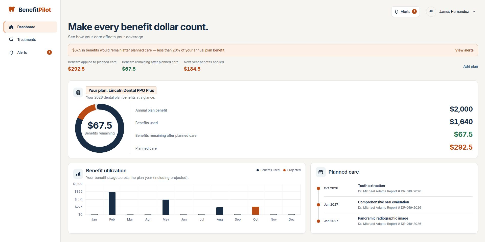
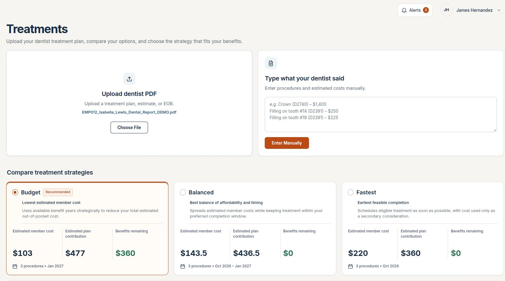
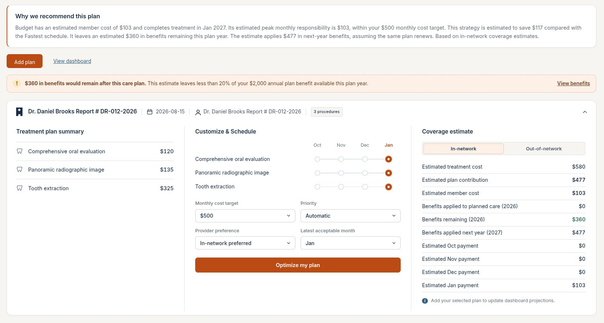
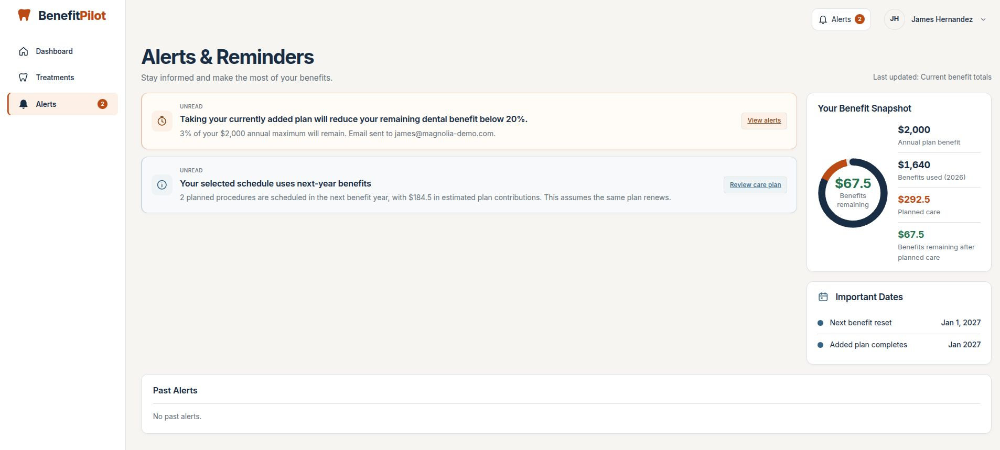

# BenefitPilot

## Live demo

**Try BenefitPilot now:** [codelinc.onrender.com/frontend/index.html](https://codelinc.onrender.com/frontend/index.html)

> A deployed employee benefits platform for understanding dental coverage,
> comparing treatment strategies, and making confident care decisions.

BenefitPilot is a full-stack employee dental benefits application deployed on
Render. It combines a Python API, a polished browser experience, plan-aware
insurance calculations, deterministic treatment optimization, and a shared
alerts experience.

The product experience is **Lincoln-inspired** in its visual direction and uses
Lincoln-inspired demo plan configurations. It is not an official Lincoln
product and does not represent universal insurer contract terms.

## Product tour

### Dashboard

See annual benefit usage, projected plan impact, remaining coverage, utilization,
planned care, and important dates in one place.



### Treatments

Upload a dentist PDF or enter procedures manually. BenefitPilot compares Budget,
Balanced, and Fastest strategies using the employee's actual enrolled plan.



### Recommendation

Every recommendation explains the tradeoffs: estimated member cost, plan
contribution, timing, monthly affordability, benefit usage, and savings versus
the fastest schedule.



### Alerts & Reminders

Get clear, actionable reminders when projected remaining benefits fall below
20% or when unused benefits may expire at year end.



## What BenefitPilot delivers

Dental benefits are often difficult to reason about when a treatment plan spans
multiple procedures, months, networks, deductibles, and annual maximums.
BenefitPilot turns those details into an employee-ready experience:

- A single benefits snapshot
- Side-by-side treatment strategies
- Plan-aware cost and coverage calculations
- Clear projected remaining-benefit warnings
- Employee-specific alerts and reminders
- A practical path from dentist estimate to treatment decision
- A live, deployable benefits workflow rather than a static mockup

## Core capabilities

### Employee-specific plan logic

Every employee is connected to a database plan through:

```text
employee.plan_id -> plans row -> plan name, maximum, deductible, coverage
```

The exact plan row controls displayed plan information and financial values.
`plan_type` controls behavior such as PPO versus in-network-only restrictions.

Seeded plan examples:

| Plan ID | Display name | Annual maximum | Network |
| --- | --- | ---: | --- |
| `PLAN_STANDARD` | Lincoln Dental PPO Standard | $1,500 | In and out of network |
| `PLAN_PLUS` | Lincoln Dental PPO Plus | $2,000 | In and out of network |
| `PLAN_INO` | Lincoln Dental In-Network | $1,750 | In network only |

### Treatment planning

- Upload text-based dentist PDFs or paste treatment details
- Extract procedures, CDT codes, categories, and estimated costs
- Compare Budget, Balanced, and Fastest schedules
- Schedule care from October 2026 through January 2027
- Keep January usage separate as next-year benefit usage
- Respect non-delayable procedures and explicit dependencies
- Add one accepted plan per employee; adding again replaces the prior projection

### Coverage-aware behavior

- PPO plans support in-network and out-of-network scenarios
- INO plans keep in-network selected and disable out-of-network controls
- Invalid INO out-of-network optimizer requests are rejected by the API
- Insurance payment, not total treatment cost, drives annual benefit usage
- Deductibles and plan-specific coverage percentages come from the employee's plan

### Alerts

- Below-20% projected remaining-benefit warning
- End-of-year unused-benefits reminder
- Simulated `Email sent to [employee email].` status for demo messaging
- Shared unread state across Dashboard, Treatments, and Alerts
- Read state is stored per employee in browser localStorage

## Architecture

```text
Browser frontend
  ├── Dashboard
  ├── Treatments
  └── Alerts & Reminders
          │
          ▼
Python HTTP API
  ├── Authentication
  ├── PDF/text extraction
  ├── Provider lookup
  ├── Plan-aware benefit calculations
  └── Deterministic treatment optimizer
          │
          ▼
SQLite seed scripts
  ├── plans.sql
  ├── employees.sql
  ├── benefit_usage.sql
  └── benefit_transactions.sql
```

### Extraction pipeline

```text
Treatment PDF or pasted text
        ↓
pdftotext / local parser
        ↓
Optional Groq normalization
        ↓
Provider and procedure metadata
        ↓
Plan-aware optimizer
        ↓
Dashboard projection and alerts
```

Groq is optional. When configured, it can improve extraction and write
explanations, but it does not choose schedules or change financial values.
The deterministic backend remains the source of truth.

## Quick start

### Requirements

- Python 3.12+
- `pdftotext` for text-based PDF extraction
- Node.js for the frontend test scripts

## Demo accounts

The demo seed data uses the shared password `password123`.

| Employee | Email | Plan |
| --- | --- | --- |
| Alex Carter | `alex.carter@usm-demo.com` | `PLAN_PLUS` |
| Amelia King | `amelia@magnolia-demo.com` | `PLAN_STANDARD` |
| Bhargav Chataut | `bhargavchataut101@gmail.com` | `PLAN_PLUS` |
| Bhaskar Chataut | `bhargavchataut9@gmail.com` | `PLAN_INO` |

These records and all treatment reports are fictional demo data.

## API surface

| Endpoint | Purpose |
| --- | --- |
| `POST /api/login` | Authenticate a seeded demo employee |
| `POST /api/extract` | Extract treatment details from PDF or text |
| `POST /api/analyze` | Extract and build treatment options |
| `POST /api/optimize` | Recalculate options using preferences |
| `POST /api/project` | Validate and price an accepted schedule |
| `GET /api/benefits` | Return employee benefit totals and history |

## Validation

Run backend tests:

```bash
python3 -m unittest discover -s tests -v
```

Run shared benefits and projection tests:

```bash
node tests/test_benefits.cjs
```

Run notification tests:

```bash
node tests/test_notifications.cjs
```

Check JavaScript syntax:

```bash
node --check frontend/results.js
node --check frontend/dashboard.js
node --check frontend/benefits.js
```

## Deployment

The application is deployed and available at:

```text
https://codelinc.onrender.com/frontend/index.html
```

The repository also includes `Dockerfile`, `Procfile`, and `render.yaml` for
repeatable deployment.
For Render:

1. Push the repository to GitHub.
2. Create a Render Blueprint from the repository.
3. Select the `main` branch.
4. Let Render use `render.yaml`.
5. Open the deployed service at `/frontend/index.html`.

The Docker image installs `poppler-utils` for PDF extraction. Render supplies
the production `PORT` automatically.

## Project structure

```text
backend/server.py                         Python API and optimizer
frontend/dashboard.html                   Benefits dashboard
frontend/results.html                     Treatment planning
frontend/alerts.html                      Alerts and reminders
frontend/theme.css                        Shared visual system
mock_lincoln_insurance_database/          Seed plans, employees, and usage
mock_dental_reports/                      Fictional demo dental reports
assests/                                  Product screenshots
tests/                                    Backend and frontend regression tests
```

## Design principles

- **Trust before novelty:** financial values remain deterministic and explainable.
- **One source of truth:** employee `plan_id` selects the actual plan row.
- **Progressive clarity:** show the important number first, then the reasoning.
- **No surprise restrictions:** unavailable network choices stay visible but
  disabled with an explanation.
- **Demo honesty:** simulated alerts and Lincoln-inspired configurations are
  labeled as demo behavior rather than official insurance promises.

## License and demo disclaimer

BenefitPilot is a demonstration project. Employee names, emails, treatment
reports, plan configurations, provider details, costs, and benefit values are
fictional and must not be used for medical care, billing, or insurance claims.
