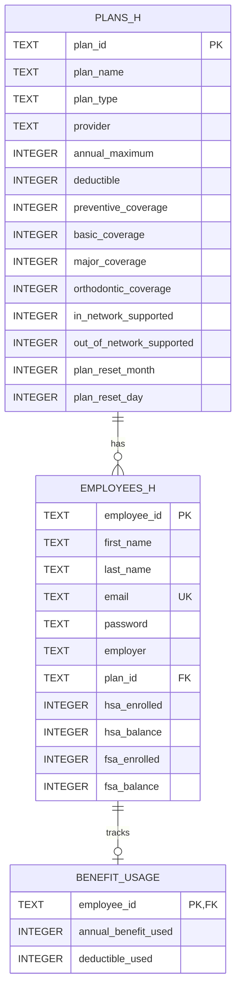

# Mock Database Schema Documentation

This document outlines the schema, field descriptions, constraints, relationships, and sample data for the mock database used in **BenefitPilot**.

---

## 1. Entity Relationship (ER) Diagram



---

## 2. Table: `plans_h`

Defines dental insurance plan benefits, coverage percentages, deductibles, and maximums.

### Schema Format

| Column Name | Data Type | Constraints | Description |
| :--- | :--- | :--- | :--- |
| `plan_id` | `TEXT` | `PRIMARY KEY` | Unique identifier for the dental plan |
| `plan_name` | `TEXT` | `NOT NULL` | Display name of the insurance plan |
| `plan_type` | `TEXT` | `NOT NULL` | Plan type category (`PPO`, `INO`) |
| `provider` | `TEXT` | `NOT NULL` | Insurance provider name (`Lincoln Financial`) |
| `annual_maximum` | `INTEGER` | `NOT NULL` | Maximum annual benefit limit in USD |
| `deductible` | `INTEGER` | `NOT NULL` | Annual deductible requirement in USD |
| `preventive_coverage` | `INTEGER` | `NOT NULL` | Coverage percentage for preventive services (e.g. `100` = 100%) |
| `basic_coverage` | `INTEGER` | `NOT NULL` | Coverage percentage for basic dental services (e.g. `80` = 80%) |
| `major_coverage` | `INTEGER` | `NOT NULL` | Coverage percentage for major dental services (e.g. `50` = 50%) |
| `orthodontic_coverage` | `INTEGER` | `NOT NULL DEFAULT 0` | Coverage percentage for orthodontic care (e.g. `50` = 50%) |
| `in_network_supported` | `INTEGER` | `NOT NULL DEFAULT 1` | In-network coverage flag (`1` = Yes, `0` = No) |
| `out_of_network_supported`| `INTEGER` | `NOT NULL DEFAULT 1` | Out-of-network coverage flag (`1` = Yes, `0` = No) |
| `plan_reset_month` | `INTEGER` | `NOT NULL DEFAULT 1` | Month the plan resets annually (1 = January) |
| `plan_reset_day` | `INTEGER` | `NOT NULL DEFAULT 1` | Day of the month the plan resets |

### Sample Data

| plan_id | plan_name | plan_type | provider | annual_maximum | deductible | preventive | basic | major | ortho | in_net | out_net | reset |
| :--- | :--- | :--- | :--- | :--- | :--- | :--- | :--- | :--- | :--- | :--- | :--- | :--- |
| `PLAN_STANDARD` | Dental PPO Standard | PPO | Lincoln Financial | $1,500 | $50 | 100% | 80% | 50% | 0% | 1 | 1 | 01/01 |
| `PLAN_PLUS` | Dental PPO Plus | PPO | Lincoln Financial | $2,000 | $50 | 100% | 90% | 60% | 50% | 1 | 1 | 01/01 |
| `PLAN_INO` | Dental In-Network | INO | Lincoln Financial | $1,750 | $25 | 100% | 80% | 50% | 0% | 1 | 0 | 01/01 |

---

## 3. Table: `employees_h`

Stores employee personal details, login credentials, employer affiliation, assigned plan, and tax-advantaged account balances (HSA/FSA).

### Schema Format

| Column Name | Data Type | Constraints | Description |
| :--- | :--- | :--- | :--- |
| `employee_id` | `TEXT` | `PRIMARY KEY` | Unique employee identifier (`EMP001` - `EMP020`) |
| `first_name` | `TEXT` | `NOT NULL` | Employee given first name |
| `last_name` | `TEXT` | `NOT NULL` | Employee family last name |
| `email` | `TEXT` | `UNIQUE NOT NULL` | Login email address |
| `password` | `TEXT` | `NOT NULL` | Account password / credential |
| `employer` | `TEXT` | `NOT NULL` | Employer company name (e.g. `USM`, `MSU`, `Delta Tech`) |
| `plan_id` | `TEXT` | `NOT NULL, FK -> plans_h(plan_id)` | Enrolled dental plan identifier |
| `hsa_enrolled` | `INTEGER` | `NOT NULL DEFAULT 0` | Health Savings Account status (`1` = Enrolled, `0` = Not Enrolled) |
| `hsa_balance` | `INTEGER` | `NOT NULL DEFAULT 0` | Current available HSA balance in USD |
| `fsa_enrolled` | `INTEGER` | `NOT NULL DEFAULT 0` | Flexible Spending Account status (`1` = Enrolled, `0` = Not Enrolled) |
| `fsa_balance` | `INTEGER` | `NOT NULL DEFAULT 0` | Current available FSA balance in USD |

### Sample Data Preview

| employee_id | first_name | last_name | email | password | employer | plan_id | hsa_enrolled | hsa_balance | fsa_enrolled | fsa_balance |
| :--- | :--- | :--- | :--- | :--- | :--- | :--- | :--- | :--- | :--- | :--- |
| `EMP001` | Alex | Carter | alex.carter@usm-demo.com | password123 | USM | PLAN_PLUS | 1 | $500 | 1 | $300 |
| `EMP002` | Maya | Patel | maya.patel@usm-demo.com | password123 | USM | PLAN_STANDARD | 0 | $0 | 1 | $400 |
| `EMP003` | Jordan | Lee | jordan.lee@usm-demo.com | password123 | USM | PLAN_INO | 1 | $900 | 0 | $0 |
| `EMP004` | Emily | Johnson | emily.johnson@usm-demo.com | password123 | USM | PLAN_PLUS | 1 | $1,250 | 1 | $250 |
| `EMP005` | Marcus | Brown | marcus.brown@msu-demo.com | password123 | MSU | PLAN_STANDARD | 1 | $600 | 0 | $0 |
| ... | ... | ... | ... | ... | ... | ... | ... | ... | ... | ... |
| `EMP020` | Harper | Scott | harper@magnolia-demo.com | password123 | Magnolia Manufacturing | PLAN_PLUS | 1 | $550 | 1 | $250 |

---

## 4. Table: `benefit_usage` (`benefit_us`)

Tracks current year-to-date insurance utilization and deductible spend for each employee.

### Schema Format

| Column Name | Data Type | Constraints | Description |
| :--- | :--- | :--- | :--- |
| `employee_id` | `TEXT` | `PRIMARY KEY, FK -> employees_h(employee_id)` | Foreign key reference to the employee |
| `annual_benefit_used` | `INTEGER` | `NOT NULL DEFAULT 0` | Benefit dollars paid out by insurance to date in USD |
| `deductible_used` | `INTEGER` | `NOT NULL DEFAULT 0` | Deductible dollars paid out of pocket to date in USD |

---

## 5. Useful Calculation Logic

When calculating remaining benefits for an employee, the standard formulas are:

```sql
-- Annual Benefit Remaining
annual_benefit_remaining = plans_h.annual_maximum - benefit_usage.annual_benefit_used

-- Deductible Remaining
deductible_remaining = MAX(0, plans_h.deductible - benefit_usage.deductible_used)
```
